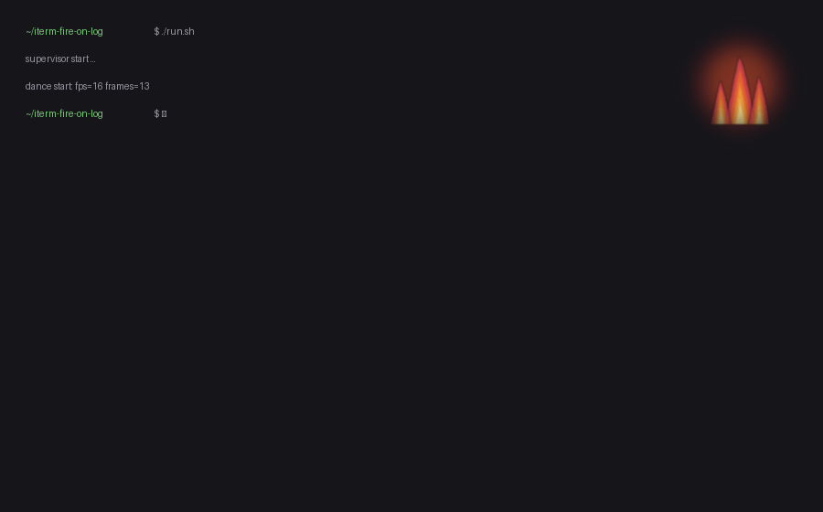

# iterm-fire-on-log

A cozy looping **fire-on-a-log** animation rendered as an **iTerm2 background
image** — a small circular orb pinned to the **top-right corner of whichever
pane currently has keyboard focus**, sitting quietly behind your terminal text.

It renders each focused pane's background at the pane's exact size and pastes a
fixed-size, soft-edged circular sprite in the corner, so the flame is always the
same physical size and never distorted — across windows, tabs and split panes.



> Bring your own GIF. No animation asset is bundled (see
> [Source GIF](#source-gif)).

## How it works

- **`fire_on_log.py`** — the animator. For each frame it finds the focused
  iTerm2 session, renders/caches a per-pane PNG with the flame sprite composited
  top-right, and sets it as the session's background image (using
  `BackgroundImageMode.STRETCH` so a pane-sized canvas maps 1:1).
- **`run.sh`** — a supervisor that keeps it alive. The iTerm2 Python API socket
  drops cleanly every few minutes; the supervisor simply relaunches, and the
  animator persists its frame index so playback resumes without a blank flash.

### Seamless looping

GIFs often have a hard cut on their native wrap (last frame → first frame). The
animator makes the loop seamless without reversing the motion (reverse playback
makes a rising flame look like it's falling):

1. **Forward-only** playback — no ping-pong.
2. **Smoothest-seam rotation** (`reorder_for_loop`) — rotate the cyclic
   sequence so the wrap lands on the least-different adjacent frame pair.
3. **Targeted seam smoothing** (`smooth_loop`) — only outlier transitions get a
   blended in-between frame inserted; every other frame stays native-crisp.
4. **Frame range** (`FRAME_RANGE`) — optionally drop reset/tail frames.

## Requirements

- **macOS** with **iTerm2**, and the iTerm2 **Python API enabled**:
  `iTerm2 → Settings → General → Magic → Enable Python API`.
- **Python 3.8+** with [Pillow](https://python-pillow.org/) and the
  [`iterm2`](https://pypi.org/project/iterm2/) package.

## Setup

```bash
git clone https://github.com/mkpurgahn/iterm-fire-on-log.git
cd iterm-fire-on-log

python3 -m venv venv
./venv/bin/pip install -r requirements.txt
```

### Source GIF

No GIF ships with this repo (animation assets may be copyrighted). Point
`FIRE_GIF` at any looping flame GIF you have the rights to use, or drop one at
`~/.fire-on-log/fire.gif`:

```bash
mkdir -p ~/.fire-on-log
cp /path/to/your/fire.gif ~/.fire-on-log/fire.gif
```

The crop defaults (`CX0, CY0, HALF` near the top of `fire_on_log.py`) are tuned
for a 480×260 GIF. For a different GIF, tweak those — or reposition live with the
`nudge` command below.

## Run

```bash
./run.sh          # supervised: keeps animating, auto-resumes on API drops
```

Or drive the animator directly:

```bash
./venv/bin/python fire_on_log.py test     # one frame on the focused pane
./venv/bin/python fire_on_log.py dance     # animate (foreground)
./venv/bin/python fire_on_log.py clear     # remove the background everywhere
```

### Stop it

```bash
touch ~/.fire-on-log/STOP
```

### Reposition the flame live (no restart)

The running animation re-reads a nudge offset each loop:

```bash
./venv/bin/python fire_on_log.py nudge left      # shift the flame left
./venv/bin/python fire_on_log.py nudge up 12     # custom step in source px
./venv/bin/python fire_on_log.py nudge set 10 -4 # absolute crop offset
./venv/bin/python fire_on_log.py nudge reset
```

## Configuration

Tunables live near the top of `fire_on_log.py` (orb size, margin, crop, loop
behavior). Runtime paths and speed are environment variables:

| Variable | Default | Purpose |
|---|---|---|
| `FIRE_GIF` | `$FIRE_ON_LOG_HOME/fire.gif` | source animation GIF |
| `FIRE_ON_LOG_HOME` | `~/.fire-on-log` | runtime cache/state/log dir |
| `PYTHON` | `./venv/bin/python` | interpreter `run.sh` uses |
| `FPS` | `16` | target frames per second |
| `MINUTES` | `60` | length of each supervised run |

## Notes & limitations

- iTerm2-specific — it relies on the iTerm2 Python API and per-session
  background images.
- Actual frame rate is capped (~12–20 fps) by per-frame Python/API overhead, so
  setting `FPS` very high won't go faster.
- This renders **your own** GIF. The original inspiration features a copyrighted
  character whose design is intentionally **not** reproduced here.

## License

[MIT](LICENSE)
